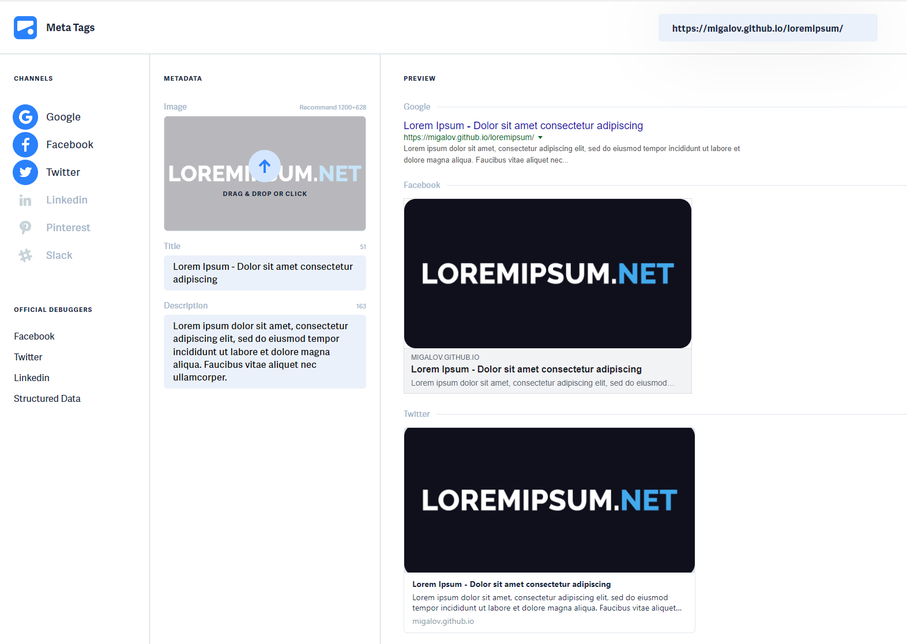
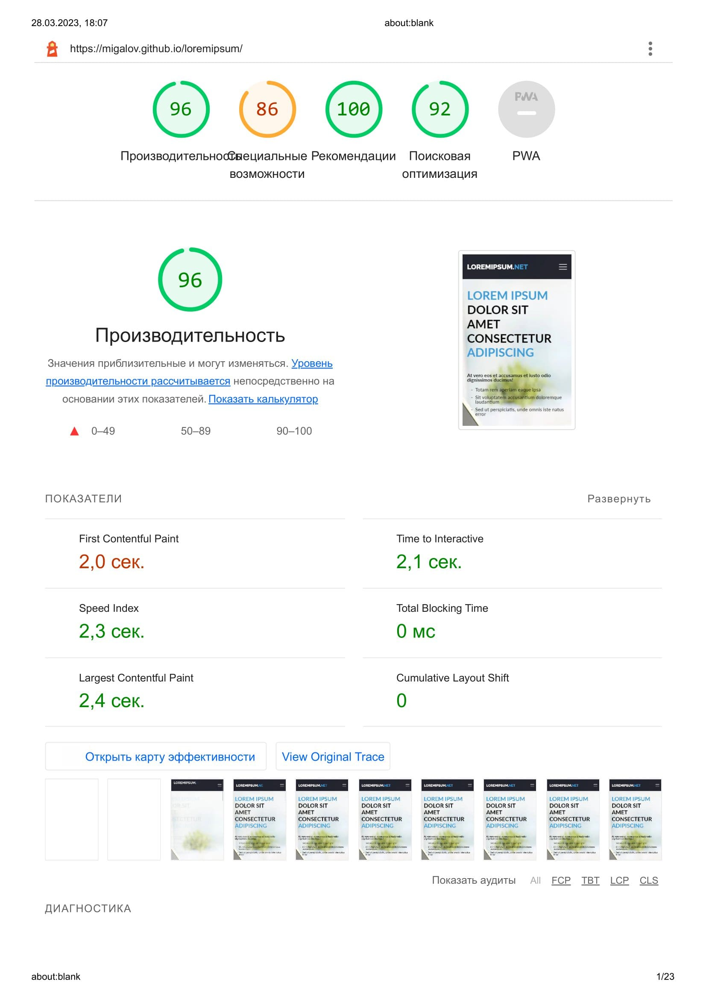
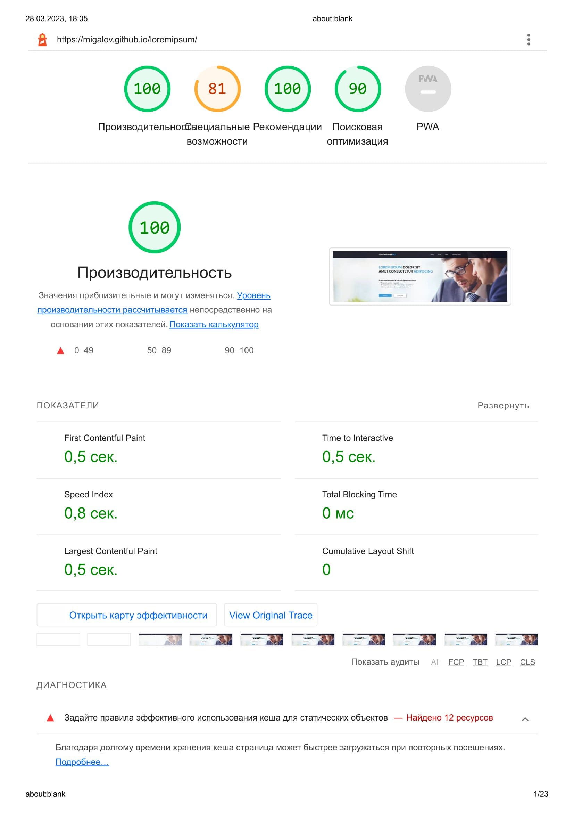
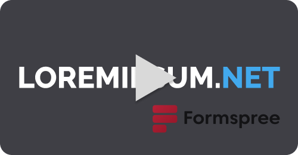

# Верстка страницы макета Lorem Ipsum


## Содержание:
  - [Основные задачи](#выполнены-основные-задачи)
  - [Дополнительные задачи](#дополнительные-задачи)
  - [Языки и инструменты](#языки-и-инструменты)
  - [Отчеты](#отчеты)
    - [Open Graph](#open-graph)
    - [Проверка валидности на БЭМ](#проверка-валидности-на-бэм)
    - [Фактическая производительность сайта](#фактическая-производительность-сайта)
  - [Локальная разработка](#локальная-разработка)

Макет: 

[](https://www.figma.com/file/2b7UqUrTs4R8JQoYutlKTu/Test?node-id=0-1)


Ссылка на сайт: https://migalov.github.io/loremipsum/

[](https://migalov.github.io/loremipsum/)

## Выполнены основные задачи:

- Сайт был адаптирован под мобильные устройства шириной не менее 320px и планшеты.
- В вёрстке соблюдалась методология БЭМ. (отчет прилагается)
- Использована стратегия Mobile First
- Большинство блоков построено на Flex и Grid
- Стили написаны при помощи препроцессора SASS в диалекте SCSS
- Предусмотрено количество пунктов и полей формы в блоке "Оформление заказа"
- Соблюдена кроссбраузерность.
- Шапка сайта зафиксирована наверху страницы
- Сборка выгружает в папку с сайтом WebP-изображения, что значительно уменьшает время загрузки страницы
- Опубликовано в Github Pages (очень помогает плагин [gh-pages](https://www.npmjs.com/package/gh-pages))


### Дополнительные задачи
- После скроллинга шапка и логотип слегка уменьшаются в размерах
- Пункт меню "Оформление заказа" прямо ведет к соответствующему блоку, учитывая размер шапки.
- Элементам сайта задана анимация (была задействована библиотека [AOS](https://michalsnik.github.io/aos/))
- Форма отправки заказа способна отправлять данные (данные попадают на аккаунт в [Formspree](https://formspree.io/) (увы с приложенным файлом сервис отказывается принимать файл вместе с данными формы и сам файл :worried:))

---
---

# Языки и инструменты

[](https://skillicons.dev)

# Отчеты
## Open Graph



## Фактическая производительность сайта
|Мобильная версия|Десктопная версия|
|----------------|-------------------------------|
|||

## Проверка валидности на БЭМ
[](https://youtu.be/Pgedn9QMjLA)

## Отправка данных через форму
[](https://youtu.be/L8QUP_OIdD4)

---
---

# Локальная разработка
Чтобы установить сборку с сайтом необходимо установить у себя на компьютере:


Открываем командную строку и скачиваем плагины (список используемых плагинов можно посмотреть в файле  [**package.json**](/package.json))
```sh
yarn
```


## Запуск режима разработки:

```sh
yarn start
```

## Сборка проекта

```sh
yarn build
```

## Деплой сборанного проекта
```sh
yarn deploy
```
